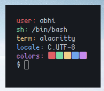

# TinyDfetch
A simple fetch in D which is tiny and fast.. it takes 0.001 to 0.004s to fetch

## Depends
- only D compiler and `TERM`, `LANG`, `USER`, `SHELL` environmental variables

## Installation

```
$ git clone https://github.com/IUseDebianBtw/tinyDfetch
$ cd tinyDfetch/src
$ gdc tinyfetch.c -o tinyfetch
$ ./tinyDfetch
```
## Preview



## License

MIT License
